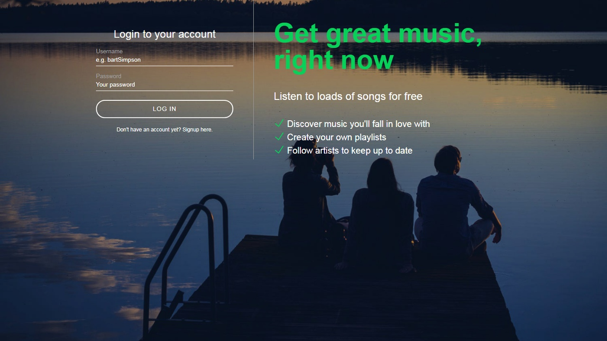
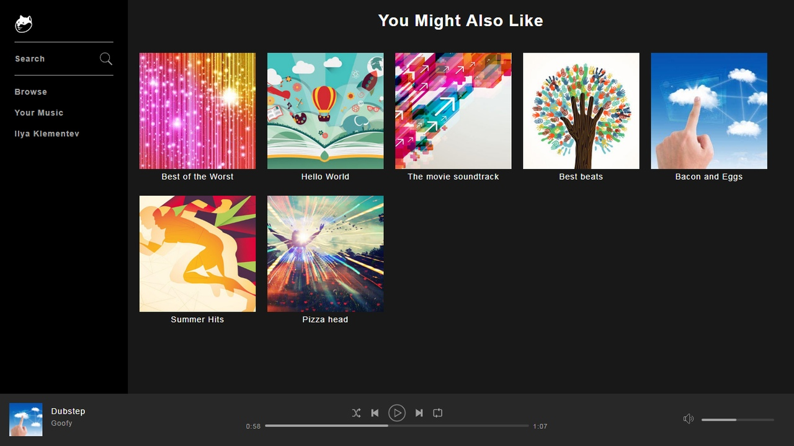
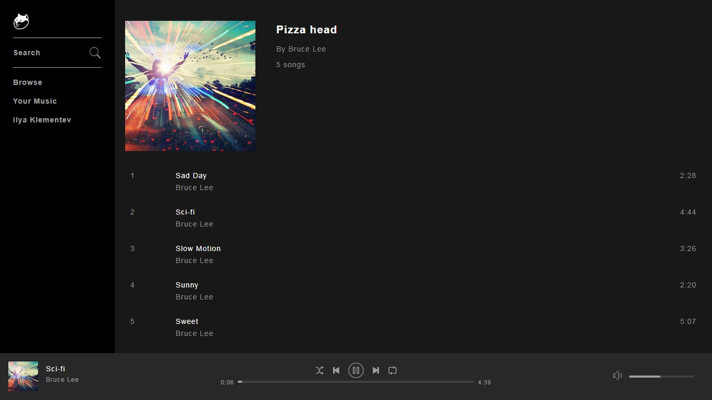

# Slotify
It is a digital music, podcast, and not video streaming service that gives you access to a few of songs.

- ## What's included: 

Within the download you'll find the following directories and files, logically 
grouping common assets and providing both compiled and minified variations. You'll see 
something like this:

```text
musicPlayer/
    ├── assets/
    │   ├── css
    │   ├── images
    │   │   ├── artwork
    │   │   ├── icons
    │   │   └── profile-pics
    │   ├── js
    │   └── music
    │   
    └── includes/
        ├── classes
        └── handlers
            └── ajax
```

- ## UI design:

1. Register page.


2. Main page.


3. Album page.


- ## Tools:

1. PHP.

2. MySQL.

3. JavaScript.

4. HTML/CSS.
